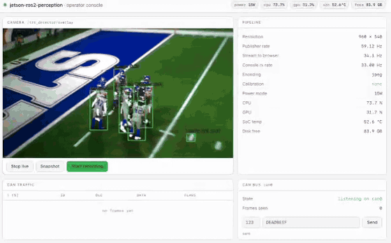

# jetson-ros2-perception

The software base layer a robot needs before any autonomy is possible — sensors
publishing at full rate, drivers that recover instead of freezing, an industrial bus on
the wire, one-click data capture, and a live view of what the machine sees — built and
validated end to end on an NVIDIA Jetson.

Concretely:

- **Camera driver (`jetson_camera`)** — C++ ROS 2 node for the IMX477 over the Jetson
  hardware ISP (Argus/GStreamer). Publishes `sensor_msgs/Image` and `CameraInfo` at a
  sustained 1920×1080 @ 60 Hz, with capture-stall detection, automatic pipeline
  recovery, and fail-fast shutdown for supervised restart (launch respawn / systemd).
- **Operator console (`operator_console`)** — browser-based operations UI served from the
  board: live video, node and host telemetry (publish rate, CPU/GPU load, power mode,
  SoC temperature), CAN frame TX/RX, and rosbag2 record control. Python standard library
  only; runs fully headless (demo below).
- **CAN bus bring-up** — SocketCAN on the carrier's isolated CAN FD interface (`mttcan`,
  500 kbit/s), validated in loopback and integrated into the console for frame injection
  and traffic monitoring.
- **Containerized deployment** — ROS 2 Humble in Docker, pinned to the board's L4T
  release; a stock JetPack 5.1.3 device reaches camera streaming with a single build and
  launch sequence.
- **On-target benchmarking** — publisher-side instrumentation of frame rate and compute
  load across sensor modes and power profiles; results and methodology in the benchmark
  table below.

*Next:* a SocketCAN ↔ ROS 2 bridge node, and a bag-replay regression harness in CI.

> **Scope:** this stack runs on real Jetson hardware, but it is not deployed on a mobile
> robot — there is no drivetrain and no autonomous navigation. Every number below was
> measured on the hardware described under *Hardware*, not in simulation.



*The operator console live: YOLOv8 detections overlaid on the camera feed at ~30 Hz, CAN
frames injected and echoed on `can0`, host telemetry and rosbag recording — all served from
the board. ([full-quality mp4](docs/media/operator-console-detection.mp4))*

## Hardware

| | |
|---|---|
| Board | Seeed reComputer **Industrial J3011** — Jetson Orin Nano 8GB, 6 cores, 7.3 GiB |
| Camera | Arducam **IMX477** on 2-lane MIPI CSI, `/dev/video0`, NVIDIA stock driver |
| Platform | **JetPack 5.1.3 / L4T R35.5.0**, Ubuntu 20.04.6, kernel 5.10.192-tegra, CUDA 11.4 |
| ROS | **Humble**, containerised (Ubuntu 20.04 has no native Humble) |
| Industrial I/O | Isolated CAN FD (DB9), RS-232/422/485, 4x DI / 4x DO, 2x GbE |

Two hardware constraints shape everything below:

- The 2-lane CSI exposes **exactly two sensor modes** — `3840x2160@30` and `1920x1080@60`,
  both `RG10` raw Bayer. There is no 12 MP mode.
- Only **7W and 15W** power modes exist on JetPack 5. The 25W/MAXN SUPER mode is
  JetPack 6.2-exclusive, so benchmarks have two power points.

## Operations

[`docs/runbook.md`](docs/runbook.md) — deployment and field debugging: first-time setup on
a fresh device, a symptom index (camera won't start, subscriber receives nothing, Ethernet
slower than Wi-Fi, CAN transmits nothing), and the platform quirks that cost time. Written
from real incidents; `PROGRESS.md` holds the underlying evidence.

## Why containers

ROS 2 Humble requires Python 3.10 and has no official Ubuntu 20.04 binaries. JetPack 5.1.3
is Ubuntu 20.04. Containers are therefore not a convenience here — they are the only way
to run Humble on this image without reflashing, which would put the working camera driver
at risk — JetPack 6.2 is where this camera is documented to break on Seeed carriers.

## Quick start

```bash
# host settings the stack depends on (DDS socket buffers, EEE, CAN) -- once per device
sudo deploy/install.sh

docker build -t jetson-ros2-perception:latest -f docker/Dockerfile .
./docker/run.sh

# inside the container
colcon build --symlink-install
source install/setup.bash
ros2 launch jetson_bringup bringup.launch.py     # camera + detector + console
```

Then open `http://<jetson-ip>:8080`. Variants: `detector:=false` for the plain camera,
`console:=false` for headless.

`deploy/install.sh` is not optional tuning — without the socket buffer settings, raw image
subscribers receive **nothing at all**. See [`docs/runbook.md`](docs/runbook.md).

The detector needs an engine built on the device (they are hardware- and TensorRT-version
specific, so they are never committed):

```bash
/usr/src/tensorrt/bin/trtexec --onnx=/models/yolov8n.onnx --fp16 \
    --saveEngine=/models/yolov8n_fp16.engine
```

**Stop with `docker stop -t 30`, never `docker rm -f`** — a SIGKILLed Argus client leaves a
session dangling in `nvargus-daemon` and the camera eventually stops starting.

## Operator console

A browser-based control surface for the stack — camera, pipeline telemetry, CAN traffic,
and the controls to actually operate it.

```bash
# usually started by the bringup launch above; standalone:
ros2 launch operator_console console.launch.py     # then open http://<jetson>:8080
```

| Shows | Controls |
|---|---|
| Live video from `/image_raw/compressed`, or the detector's overlay | Start/stop `rosbag2` recording, with live size and elapsed |
| Publisher rate, resolution, encoding | Snapshot the current frame to disk |
| Calibration loaded / not | Inject a CAN frame (id + payload) |
| Power mode, CPU, GPU, SoC temp, disk free | |
| Live CAN frame table with ID/DLC/data/flags | |

This is **not** a Foxglove or `rqt` replacement — those visualise topics and do it better.
The console exists for the part they don't do: triggering recordings, capturing stills and
putting frames on the bus, from one page, on a headless board.

Four details worth calling out:

- It reports the **publisher's** frame rate, which the camera node measures and publishes on
  `~/publish_rate` — not the rate the console itself receives. Timing your own arrivals
  measures your own consumption: `ros2 topic hz` read **47.8 Hz while the publisher was at
  60.0 Hz**, because deserialising ~6 MB frames in Python is slower than producing them.
  Both figures are shown and labelled, since the gap between them is itself informative.
- **No new dependencies.** `rclpy`, `cv2` and the Python standard library only. The
  container has no flask/fastapi and no ROS web packages, and with no Humble binaries for
  Ubuntu 20.04 every addition would have meant a source build.
- **The view consumes `/image_raw/compressed`** — JPEGs encoded in C++ by the camera's
  image_transport plugin — and serves the bytes untouched. The first design subscribed to
  raw `/image_raw`; deserialising 6.2 MB frames in Python capped the console at 13–50 Hz
  and was the real cause of a laggy view. ~200 KB JPEGs deserialise trivially, and the
  console never touches a pixel. Delivery is long-polled: each request names the last
  frame it saw and is answered when a newer one exists, so every round trip carries a
  fresh frame (measured: ~30 fps to one browser, zero duplicates).
- **The console subscribes only while someone is watching.** The compressed plugin is
  lazy, and its encode runs synchronously in the camera's capture loop — measured cost is
  60 → ~36 Hz at 1080p while subscribed. Five seconds after the last browser request the
  console unsubscribes and the pipeline returns to full rate. The tradeoff is printed in
  the panel itself: publisher rate dips while you watch, and recovers when you stop.

## Packages

| Package | Purpose |
|---|---|
| `jetson_camera` | Argus (hardware ISP) → `sensor_msgs/Image` + `CameraInfo`, with capture-stall detection and supervised recovery |
| `trt_detector` | YOLOv8 via TensorRT → `Detection2DArray` + compressed overlay, per-stage latency instrumentation |
| `operator_console` | Browser operations UI: live video, telemetry, CAN TX/RX, rosbag2 control |
| `jetson_bringup` | One launch file for the whole stack |

Planned: `can_bridge` (SocketCAN ↔ ROS 2 messages — CAN currently runs through the console
only), `bag_tools` (recorder + replay regression harness).

**Cancelled:** CUDA preprocessing. It was planned, then measured out — preprocessing costs
4.0 ms on the CPU against a 33 ms frame budget, so a GPU kernel could not pay for itself.
The measurement is in `PROGRESS.md`.

## Benchmarks

All figures measured on the hardware above at 15W, publisher-side. 7W rows pending.

**Camera** (`jetson_camera`, no subscribers unless stated):

| Configuration | Rate | Notes |
|---|---|---|
| 1920×1080@60 | **60.0 Hz** | 0.65 core, GPU idle |
| 3840×2160@30 | **29.9 Hz** | 1.0 core; full sensor rate |
| ↳ same, `videoconvert n-threads=1` | 26.9 Hz | 11% short — one core pinned at 74% while five idled. The default is single-threaded; `n-threads=0` recovers full rate. |
| 1920×1080@60, detector subscribed | **60.0 Hz** | Unaffected. Before the DDS socket-buffer fix this collapsed to 29.3 Hz — the kernel's 208 KB default cannot carry 6.2 MB frames. |

**Detection** (`trt_detector`, YOLOv8n FP16, camera at 1080p60, console displaying the overlay):

| Metric | Value |
|---|---|
| Detection rate | **38 Hz** |
| End-to-end latency | **24.7 ms** — preprocess 3.9 + inference 10.1 + decode/NMS 4.0 + overlay 6.7 |
| Load | CPU ~90% (all six cores, whole stack), GPU 59% |

The overlay is encoded only while something subscribes, and downscaled to 960 px first:
at full 1080p that single step cost 33.4 ms — more than inference — and halved the
detector to 17.7 Hz.

**Model inference** (YOLOv8n, `trtexec`, batch 1, 640×640, TensorRT 8.5.2, 15W —
engines built on-device):

| Precision | GPU compute (median) | Throughput | Engine size |
|---|---|---|---|
| FP16 | **7.52 ms** | 130.5 qps | 8.1 MB |
| FP32 | 13.39 ms | 72.9 qps | 14 MB |

Rates are measured **publisher-side**, by the node counting its own frames. `ros2 topic hz`
under-reports badly here — it is a Python subscriber deserialising ~6.2 MB per frame, so it
measures its own throughput, not the pipeline's. It read 47.8 Hz against an actual 60.0 Hz.

## Repository layout

```
docker/       Dockerfile, run.sh (the verified container flags), cyclonedds.xml
deploy/       host settings as systemd units + sysctl (install.sh)
docs/         runbook.md, demo media
src/          jetson_camera, trt_detector, operator_console, jetson_bringup
```

## License

Apache-2.0 — see [LICENSE](LICENSE).
